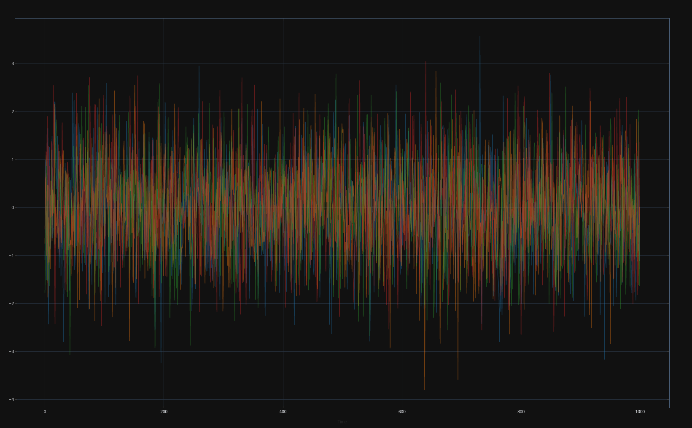
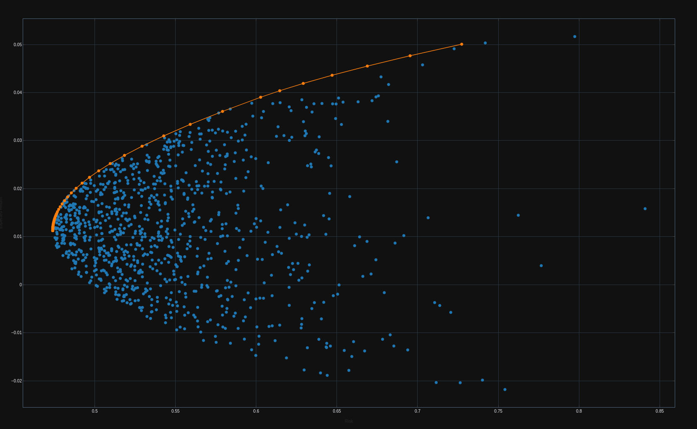

# Fintech Exploration
Fintech algorithm and concept exploration repository

## Contents
### Markowitz Portfolio Optimization (Modern Portfolio Optimization)
- Source: https://plotly.com/python/v3/ipython-notebooks/markowitz-portfolio-optimization/
- Location: `notebooks/markowitz.ipynb`
- Sneakpeak:

#### Random Asset Returns

#### Efficient Frontier of Investment for Random Portfolios

